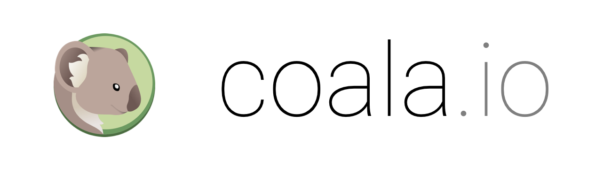

Welcome to coala API Documentation
==================================

Hey there! You're in the right place if you:

- want to develop coala itself!
- want to develop a bear for coala.

If you're trying to **use** coala, you should have a look at our
`user documentation`_ instead.

.. toctree::
   :caption: Home
   :hidden:

   Welcome <self>
   Code of Conduct <http://coala.io/coc>

.. toctree::
   :caption: coala API Documentation
   :maxdepth: 4

   coalib

.. toctree::
   :caption: For Developers
   :hidden:

   Newcomers' Guide <Developers/Newcomers_Guide>
   Documentation coala settings <Developers/coala_settings>
   Bear Installation Tool <Developers/Bear_Installation_Tool>
   Writing Good Commit Messages <Developers/Writing_Good_Commits>
   Codestyle <Developers/Codestyle>
   Git Basics <Developers/Git_Basics>
   Review <Developers/Review>
   Development Setup <Developers/Development_Setup>
   Adding CI to your Fork <Developers/Adding_CI>
   Writing Native Bears <Developers/Writing_Native_Bears>
   Writing Linter Bears <Developers/Writing_Linter_Bears>
   Linter Bears - Advanced <Developers/Linter_Bears_Advanced>
   External Bears <Developers/External_Bears>
   Testing Bears <Developers/Testing_Bears>
   Writing Tests <Developers/Writing_Tests>
   Writing Documentation <Developers/Writing_Documentation>
   Executing Tests <Developers/Executing_Tests>
   Useful Links <Developers/Useful_Links>

.. _user documentation: https://docs.coala.io
